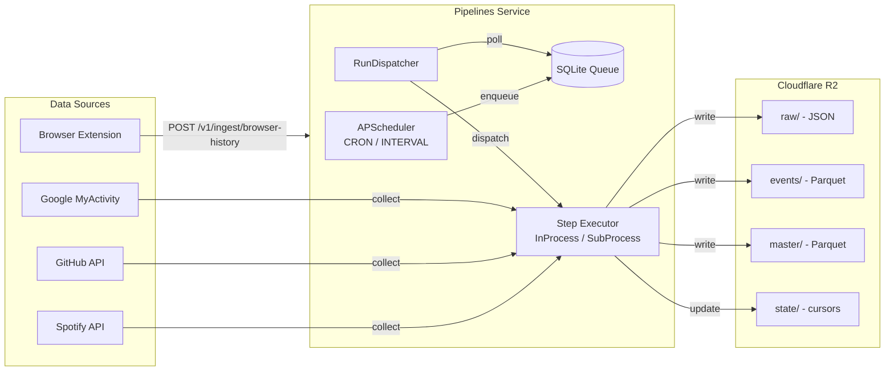
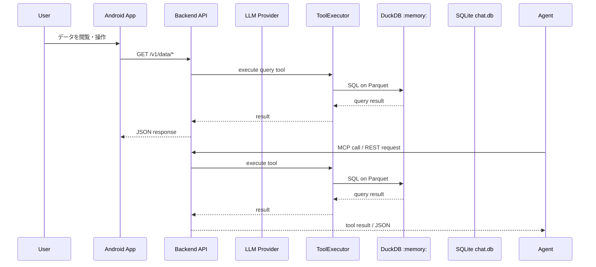

# システムアーキテクチャ

> 最終更新: 2026-06-10

## 1. システム概要

EgoGraphは、分散する個人データを統合し、AIエージェントを通じて自然言語で分析・対話できる基盤。**サーバーレス・ローカルファースト**を設計原則とする。

### 1.1 構成要素

| コンポーネント | 言語 | 責務 |
|---|---|---|
| **Pipelines Service** | Python 3.12+ | スケジュール駆動のデータ収集・ETL |
| **Backend (Data API / MCP Server)** | Python 3.12+ | データアクセスREST API + MCP Server |
| **Frontend (Mobile App)** | Kotlin Multiplatform | Android ネイティブチャットUI |
| **Browser Extension** | Chromium | ブラウザ履歴収集 |

### 1.2 モノレポ構成

```
egograph/
├── egograph/
│   ├── pipelines/          # Pipelines Service (uv workspace member)
│   └── backend/            # Backend API (uv workspace member)
├── frontend/
│   ├── shared/             # KMP shared module
│   └── androidApp/         # Android app entry point
├── browser-extension/
│   └── chromium-history/   # Chrome extension (browser history)
├── scripts/                # 運用スクリプト
├── .github/workflows/      # CI/CD
└── pyproject.toml          # Python workspace 設定
```

### 1.3 コンポーネント詳細

各コンポーネントのアーキテクチャ・テスト戦略は個別ドキュメントを参照。

| コンポーネント | ドキュメント | 概要 |
|---|---|---|
| Pipelines Service | [pipelines.md](./pipelines.md) | データ収集・ETL 常駐サービス |
| Backend (Data API / MCP) | [backend.md](./backend.md) | データ提供 REST API + MCP Server |
| Frontend (Mobile App) | [frontend/architecture.md](../frontend/architecture.md) | Android ネイティブアプリ |
| データ戦略 | [data-strategy.md](./data-strategy.md) | ストレージ責務分離・配置ルール |
| 技術スタック | [tech-stack.md](./tech-stack.md) | 言語・フレームワーク・インフラ一覧 |

---

## 2. 全体アーキテクチャ

### 2.1 データ収集フロー（Write Path）



### 2.2 分析・対話フロー（Read Path）



### 2.3 EgoPulse（独立エージェント）

> EgoPulseは [endo-ly/egopulse](https://github.com/endo-ly/egopulse) に切り出された。EgoGraphのデータに直接アクセスせず、MCP/HTTP経由で連携する独立したエージェントランタイム。詳細は同リポジトリを参照。

---

## 3. データフロー

### 3.1 書き込み（Ingestion）

```
1. Trigger: APScheduler (CRON/INTERVAL) または Event API
2. Queue: SQLite に workflow_run を enqueue
3. Dispatch: RunDispatcher が poll → lease → execute
4. Collect: 各Sourceが外部APIからデータ取得
5. Transform: スキーママッピング、Parquet変換
6. Store: R2 に raw/ (JSON), events/ (Parquet), master/ (Parquet) を保存
7. State: R2 state/ にカーソル位置を更新
```

### 3.2 読み取り（Analytics / Tool Access）

```
1. Request: Frontend または外部エージェントが Backend に問い合わせる
2. Tool: ToolExecutor が該当ツールを実行
3. DuckDB: :memory: 接続で R2 Parquet を httpfs 経由でクエリ
   （ローカルミラーがあれば優先）
4. Response: JSON または MCP tool result を返す
5. Agent side: EgoPulse などの外部エージェントが必要に応じて応答生成や自律実行を行う
```

> R2 ディレクトリ構造の詳細 → [data-strategy.md](./data-strategy.md)

---

## 4. CI/CD

### 4.1 GitHub Actions ワークフロー

| ワークフロー | トリガー | 内容 |
|---|---|---|
| `ci-backend.yml` | `egograph/backend/**` | Backend テスト・Lint |
| `ci-pipelines.yml` | `egograph/pipelines/**` | Pipelines テスト・Lint |
| `ci-frontend.yml` | `frontend/**` | Frontend テスト・Lint |
| `ci-browser-extension.yml` | `browser-extension/**` | Extension ビルド |
| `deploy-backend.yml` | `main` push | Backend/Pipelines デプロイ |
| `release-frontend-kmp.yml` | タグ | Frontend リリース |

### 4.2 テストピラミッド

| レイヤー | Python | Frontend |
|---|---|---|
| Unit | pytest | kotlin-test |
| Integration | pytest (fixtures) | Turbine + MockK |
| E2E | pytest (live, 要認証) | Maestro |
| Lint | Ruff | Ktlint + Detekt |

---

## 5. セキュリティ

### 5.1 認証

| コンポーネント | 方式 |
|---|---|
| Pipelines API | API Key 検証 |
| Backend API | API Key 検証 |

### 5.2 データ保護

- APIキー・認証情報は環境変数で管理（`.env` はGit管理外）
- Backendのエラーレスポンスから機密情報を自動除去（`_redact_string`）
- DuckDBのSECRET名はSHA-256ハッシュで衝突回避
- CORS設定は環境変数から制御

> 各コンポーネントの認証・セキュリティ詳細 → [pipelines.md](./pipelines.md), [backend.md](./backend.md)

---

## 6. 現状と制約

### 6.1 コンポーネント成熟度

| コンポーネント | 状態 | 備考 |
|---|---|---|
| Pipelines Service | 運用中 | 4データソース + ローカルミラー同期 |
| Backend | 運用中 | Data API + MCP Server |
| Frontend | 開発中 | データ可視化中心に拡張中。EgoPulse 連携は検討中 |
| Browser Extension | 保守中 | 履歴収集 → Pipelines API送信 |
| [EgoPulse](https://github.com/endo-ly/egopulse) | 運用中 | 独立リポジトリで開発中 |

### 6.2 未実装・制限事項

- **Qdrant（ベクトル検索）**: 設計段階。実装なし
- **YouTubeツール**: 2025-02-04より一時非推奨
- **Last.fm**: ジョブ停止中
- **Frontend ターミナル**: ディレクトリ構造のみ（WIP）
- **データ可視化**: MermaidDiagram（マークダウン図レンダリング）のみ実装済み
- **モニタリング**: 未実装

### 6.3 既知の技術的負債

- `data-strategy.md` に記載されているQdrant前提の表現は現状と不一致
- 会話履歴のベクトル化方式は未選定
- DockerデプロイはBackendのみ（Pipelines分離デプロイ未対応）
